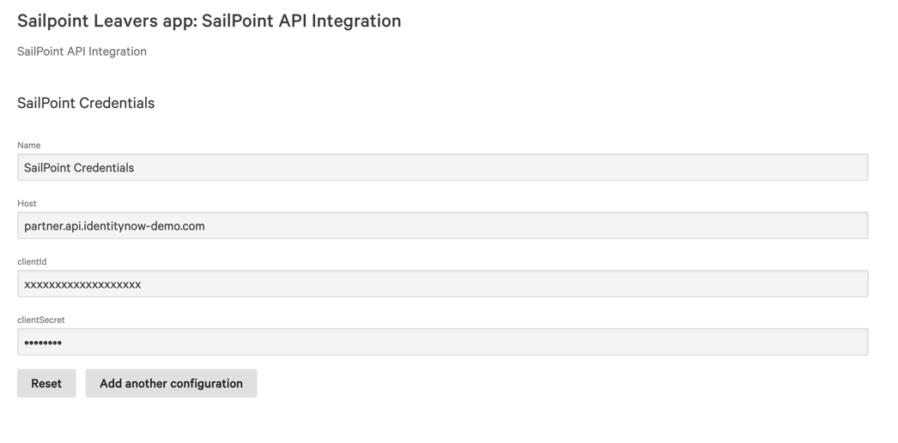
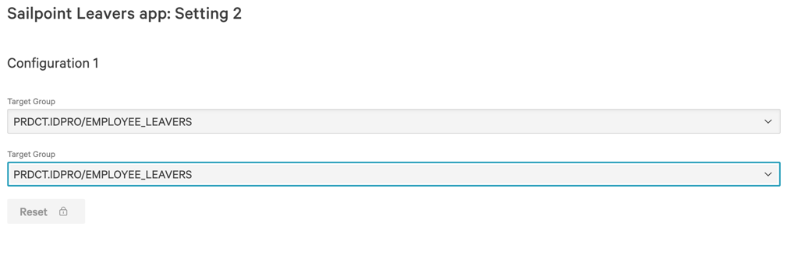

# Foundry Sample Insider Risk - SailPoint

Organizations face critical security challenges when employees leave and have elevated access to sensitive data. 
The sample Foundry Insider Risk SailPoint helps automate the process of monitoring leaving employees.
This application helps teams:

* Monitor high-risk individuals who may pose insider threats.
* Automatically track employees during their departure process.
* Enhance protection of sensitive data during critical transition periods.
* Maintain security oversight for users with privileged access.

This app illustrates the following functionality amongst other components:
* Fetch Leaving/departing employees data from [SailPoint](https://www.sailpoint.com/).
* Add employees to Identity Protection watchlist and AD group using Workflow built-in actions for enhanced monitoring capabilities.
* Remove employees from Identity Protection watchlist and AD group using Workflow built-in actions after 30 days of their departure date.

## Foundry capabilities used

* **API-Integration** Used to connect to SailPoint API to get leaving employee data.
* **Function** To fetch employee linked accounts. If a departing user is an admin, they have a regular account with email and an administrative account without the email.
* **Saved-Search** Query departing employees data
* **Workflow templates** Workflow to execute API-Integrations to get leaving employees data from SailPoint and add/remove employees to/from Identity Protection watchlist.

## Install App Configuration

When you install this app, you will be prompted for app configuration. Your configuration should look similar to the following.
* (API-Integration) SailPoint API credentials:
   * **SailPoint host**: Your SailPoint host (ex: `test-partner.api.identitynow-demo.com`)
   * **ClientId** Your SailPoint API client Id
   * **ClientSecret** Your SailPoint API client secret

     **Example**:
     

* (Workflow) 'Add Sailpoint leavers to IDP and AD group' & 'Remove SailPoint leavers from IDP and AD group' configuration:
   * **Target Group**: Leavers Active Directory group name

     **Example**:
     

> [!NOTE]
>
> You will notice the same configurations been asked a couple of times. This is because there are two workflows (Add Sailpoint leavers to IDP and AD group & Remove SailPoint leavers from IDP and AD group) using the same configurations.

## Usage

After installing the app, go to **Fusion SOAR** > **Workflows** to see the workflows for Insider Threat. 

The source code for this app can be found on GitHub: <https://github.com/CrowdStrike/foundry-sample-insider-risk-sailpoint>. 